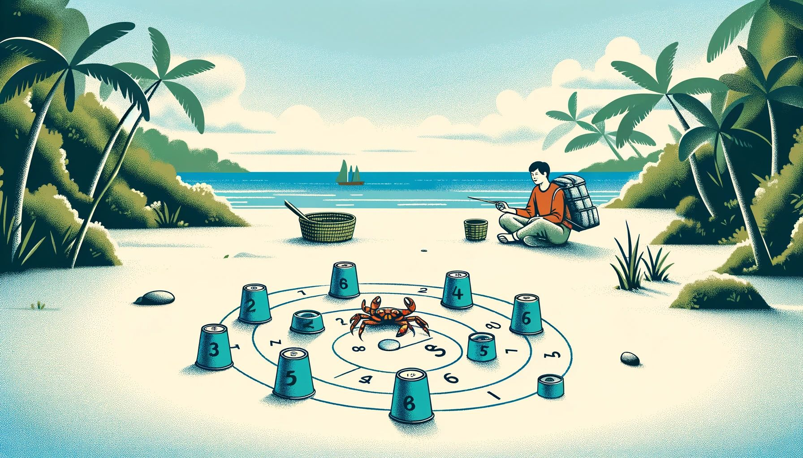

# Day 23: Crab Cups

The small crab challenges you to a game! The crab is going to mix up some cups, and you have to predict where they'll
end up.

The cups will be arranged in a circle and labeled clockwise (your puzzle input). For example, if your labeling were
32415, there would be five cups in the circle; going clockwise around the circle from the first cup, the cups would be
labeled 3, 2, 4, 1, 5, and then back to 3 again.

