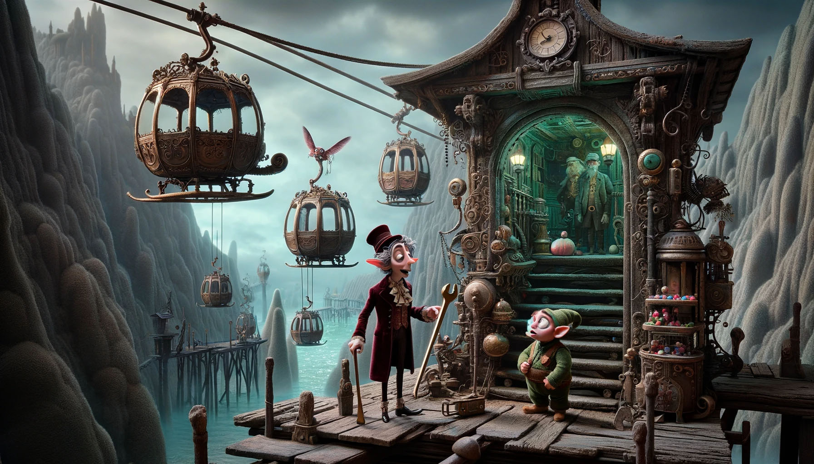

# Day 3: Gear Ratios

You and the Elf eventually reach a gondola lift station; he says the gondola lift will take you up to the water source,
but this is as far as he can bring you. You go inside.

It doesn't take long to find the gondolas, but there seems to be a problem: they're not moving.

"Aaah!"

You turn around to see a slightly-greasy Elf with a wrench and a look of surprise. "Sorry, I wasn't expecting anyone!
The gondola lift isn't working right now; it'll still be a while before I can fix it." You offer to help.

The engineer explains that an engine part seems to be missing from the engine, but nobody can figure out which one. If
you can add up all the part numbers in the engine schematic, it should be easy to work out which part is missing.

