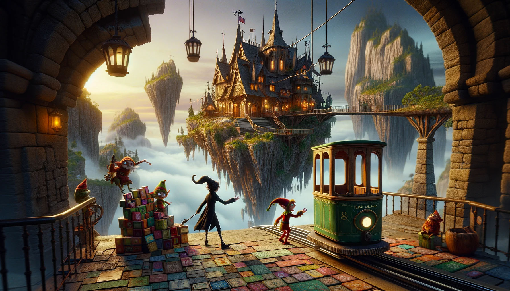

# --- Day 4: Scratchcards ---
The gondola takes you up. Strangely, though, the ground doesn't seem to be coming with you; you're not climbing a mountain. As the circle of Snow Island recedes below you, an entire new landmass suddenly appears above you! The gondola carries you to the surface of the new island and lurches into the station.

As you exit the gondola, the first thing you notice is that the air here is much warmer than it was on Snow Island. It's also quite humid. Is this where the water source is?

The next thing you notice is an Elf sitting on the floor across the station in what seems to be a pile of colorful square cards.

"Oh! Hello!" The Elf excitedly runs over to you. "How may I be of service?" You ask about water sources.

"I'm not sure; I just operate the gondola lift. That does sound like something we'd have, though - this is Island Island, after all! I bet the gardener would know. He's on a different island, though - er, the small kind surrounded by water, not the floating kind. We really need to come up with a better naming scheme. Tell you what: if you can help me with something quick, I'll let you borrow my boat and you can go visit the gardener. I got all these scratchcards as a gift, but I can't figure out what I've won."

