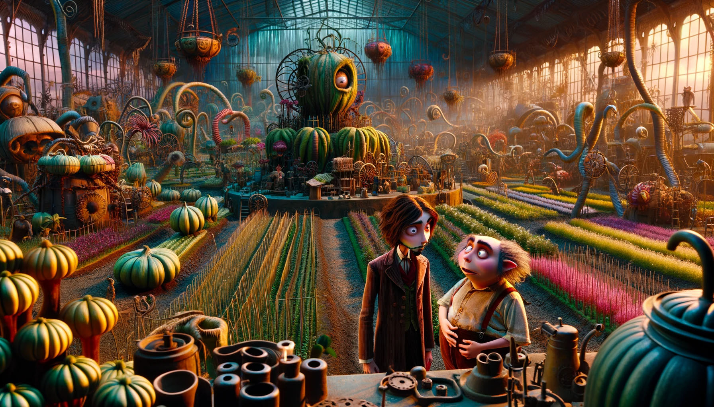

# Day 5: If You Give A Seed A Fertilizer

You take the boat and find the gardener right where you were told he would be: managing a giant "garden" that looks more
to you like a farm.

"A water source? Island Island is the water source!" You point out that Snow Island isn't receiving any water.

"Oh, we had to stop the water because we ran out of sand to filter it with! Can't make snow with dirty water. Don't
worry, I'm sure we'll get more sand soon; we only turned off the water a few days... weeks... oh no." His face sinks
into a look of horrified realization.

"I've been so busy making sure everyone here has food that I completely forgot to check why we stopped getting more
sand! There's a ferry leaving soon that is headed over in that direction - it's much faster than your boat. Could you
please go check it out?"

You barely have time to agree to this request when he brings up another. "While you wait for the ferry, maybe you can
help us with our food production problem. The latest Island Island Almanac just arrived and we're having trouble making
sense of it."

