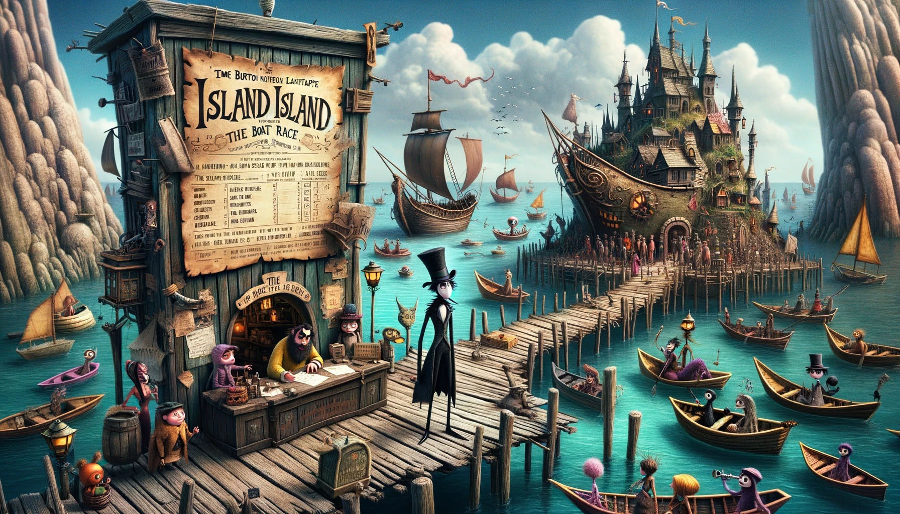

# --- Day 6: Wait For It ---

The ferry quickly brings you across Island Island. After asking around, you discover that there is indeed normally a
large pile of sand somewhere near here, but you don't see anything besides lots of water and the small island where the
ferry has docked.

As you try to figure out what to do next, you notice a poster on a wall near the ferry dock. "Boat races! Open to the
public! Grand prize is an all-expenses-paid trip to Desert Island!" That must be where the sand comes from! Best of all,
the boat races are starting in just a few minutes.

You manage to sign up as a competitor in the boat races just in time. The organizer explains that it's not really a
traditional race - instead, you will get a fixed amount of time during which your boat has to travel as far as it can,
and you win if your boat goes the farthest.

As part of signing up, you get a sheet of paper (your puzzle input) that lists the time allowed for each race and also
the best distance ever recorded in that race. To guarantee you win the grand prize, you need to make sure you go farther
in each race than the current record holder.

