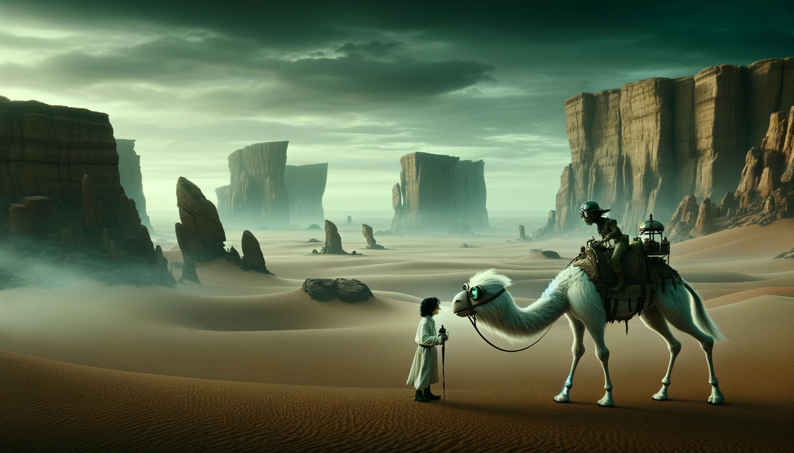

# Day 7: Camel Cards

Your all-expenses-paid trip turns out to be a one-way, five-minute ride in an airship. (At least it's a cool airship!)
It drops you off at the edge of a vast desert and descends back to Island Island.

"Did you bring the parts?"

You turn around to see an Elf completely covered in white clothing, wearing goggles, and riding a large camel.

"Did you bring the parts?" she asks again, louder this time. You aren't sure what parts she's looking for; you're here
to figure out why the sand stopped.

"The parts! For the sand, yes! Come with me; I will show you." She beckons you onto the camel.

After riding a bit across the sands of Desert Island, you can see what look like very large rocks covering half of the
horizon. The Elf explains that the rocks are all along the part of Desert Island that is directly above Island Island,
making it hard to even get there. Normally, they use big machines to move the rocks and filter the sand, but the
machines have broken down because Desert Island recently stopped receiving the parts they need to fix the machines.

You've already assumed it'll be your job to figure out why the parts stopped when she asks if you can help. You agree
automatically.

Because the journey will take a few days, she offers to teach you the game of Camel Cards. Camel Cards is sort of
similar to poker except it's designed to be easier to play while riding a camel.

