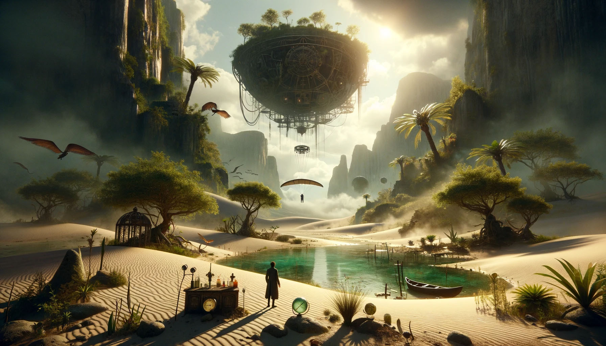

# --- Day 9: Mirage Maintenance ---

You ride the camel through the sandstorm and stop where the ghost's maps told you to stop. The sandstorm subsequently
subsides, somehow seeing you standing at an oasis!

The camel goes to get some water and you stretch your neck. As you look up, you discover what must be yet another giant
floating island, this one made of metal! That must be where the parts to fix the sand machines come from.

There's even a hang glider partially buried in the sand here; once the sun rises and heats up the sand, you might be
able to use the glider and the hot air to get all the way up to the metal island!

While you wait for the sun to rise, you admire the oasis hidden here in the middle of Desert Island. It must have a
delicate ecosystem; you might as well take some ecological readings while you wait. Maybe you can report any
environmental instabilities you find to someone so the oasis can be around for the next sandstorm-worn traveler.

