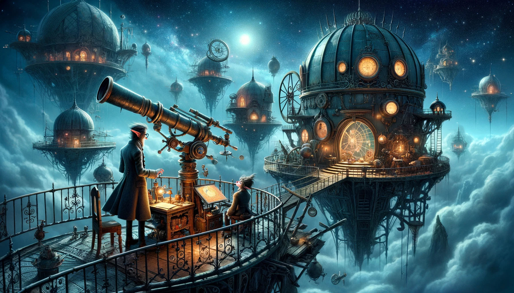

# --- Day 11: Cosmic Expansion ---

You continue following signs for "Hot Springs" and eventually come across an observatory. The Elf within turns out to be
a researcher studying cosmic expansion using the giant telescope here.

He doesn't know anything about the missing machine parts; he's only visiting for this research project. However, he
confirms that the hot springs are the next-closest area likely to have people; he'll even take you straight there once
he's done with today's observation analysis.

Maybe you can help him with the analysis to speed things up?

