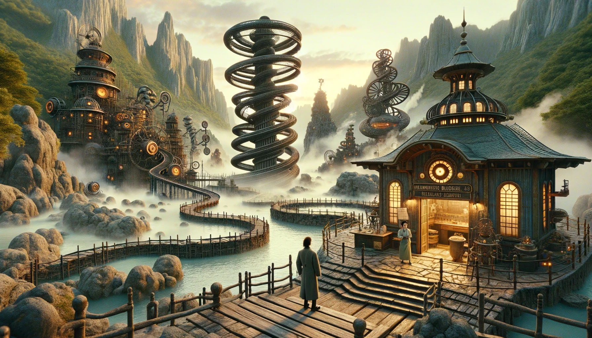

# --- Day 12: Hot Springs ---

You finally reach the hot springs! You can see steam rising from secluded areas attached to the primary, ornate
building.

As you turn to enter, the researcher stops you. "Wait - I thought you were looking for the hot springs, weren't you?"
You indicate that this definitely looks like hot springs to you.

"Oh, sorry, common mistake! This is actually the onsen! The hot springs are next door."

You look in the direction the researcher is pointing and suddenly notice the massive metal helixes towering overhead. "
This way!"

It only takes you a few more steps to reach the main gate of the massive fenced-off area containing the springs. You go
through the gate and into a small administrative building.

"Hello! What brings you to the hot springs today? Sorry they're not very hot right now; we're having a lava shortage at
the moment." You ask about the missing machine parts for Desert Island.

"Oh, all of Gear Island is currently offline! Nothing is being manufactured at the moment, not until we get more lava to
heat our forges. And our springs. The springs aren't very springy unless they're hot!"

"Say, could you go up and see why the lava stopped flowing? The springs are too cold for normal operation, but we should
be able to find one springy enough to launch you up there!"

