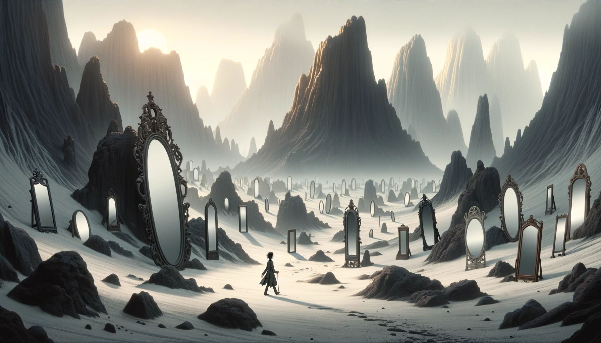

# --- Day 13: Point of Incidence ---

With your help, the hot springs team locates an appropriate spring which launches you neatly and precisely up to the
edge of Lava Island.

There's just one problem: you don't see any lava.

You do see a lot of ash and igneous rock; there are even what look like gray mountains scattered around. After a while,
you make your way to a nearby cluster of mountains only to discover that the valley between them is completely full of
large mirrors. Most of the mirrors seem to be aligned in a consistent way; perhaps you should head in that direction?

As you move through the valley of mirrors, you find that several of them have fallen from the large metal frames keeping
them in place. The mirrors are extremely flat and shiny, and many of the fallen mirrors have lodged into the ash at
strange angles. Because the terrain is all one color, it's hard to tell where it's safe to walk or where you're about to
run into a mirror.

