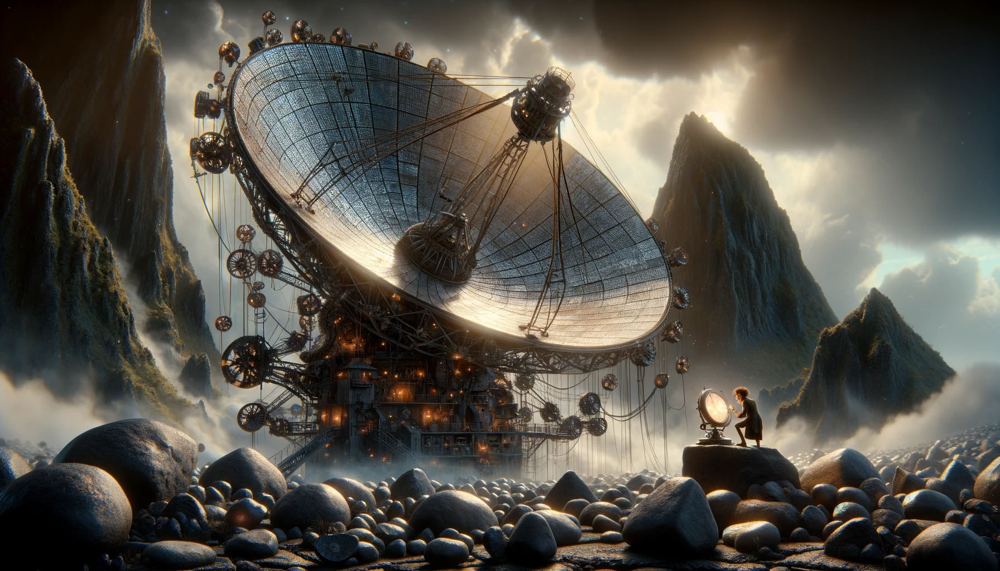

# --- Day 14: Parabolic Reflector Dish ---
You reach the place where all of the mirrors were pointing: a massive parabolic reflector dish attached to the side of another large mountain.

The dish is made up of many small mirrors, but while the mirrors themselves are roughly in the shape of a parabolic reflector dish, each individual mirror seems to be pointing in slightly the wrong direction. If the dish is meant to focus light, all it's doing right now is sending it in a vague direction.

This system must be what provides the energy for the lava! If you focus the reflector dish, maybe you can go where it's pointing and use the light to fix the lava production.

Upon closer inspection, the individual mirrors each appear to be connected via an elaborate system of ropes and pulleys to a large metal platform below the dish. The platform is covered in large rocks of various shapes. Depending on their position, the weight of the rocks deforms the platform, and the shape of the platform controls which ropes move and ultimately the focus of the dish.

