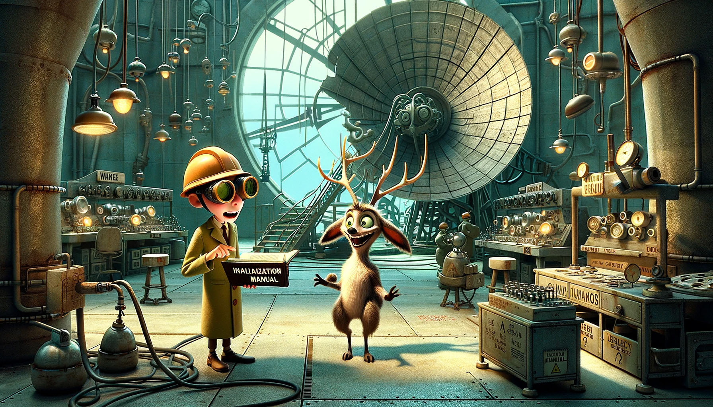

# Day 15: Lens Library

The newly-focused parabolic reflector dish is sending all of the collected light to a point on the side of yet another
mountain - the largest mountain on Lava Island. As you approach the mountain, you find that the light is being collected
by the wall of a large facility embedded in the mountainside.

You find a door under a large sign that says "Lava Production Facility" and next to a smaller sign that says "Danger -
Personal Protective Equipment required beyond this point".

As you step inside, you are immediately greeted by a somewhat panicked reindeer wearing goggles and a loose-fitting hard
hat. The reindeer leads you to a shelf of goggles and hard hats (you quickly find some that fit) and then further into
the facility. At one point, you pass a button with a faint snout mark and the label "PUSH FOR HELP". No wonder you were
loaded into that trebuchet so quickly!

You pass through a final set of doors surrounded with even more warning signs and into what must be the room that
collects all of the light from outside. As you admire the large assortment of lenses available to further focus the
light, the reindeer brings you a book titled "Initialization Manual".

"Hello!", the book cheerfully begins, apparently unaware of the concerned reindeer reading over your shoulder. "This
procedure will let you bring the Lava Production Facility online - all without burning or melting anything unintended!"

"Before you begin, please be prepared to use the Holiday ASCII String Helper algorithm (appendix 1A)." You turn to
appendix 1A. The reindeer leans closer with interest.

