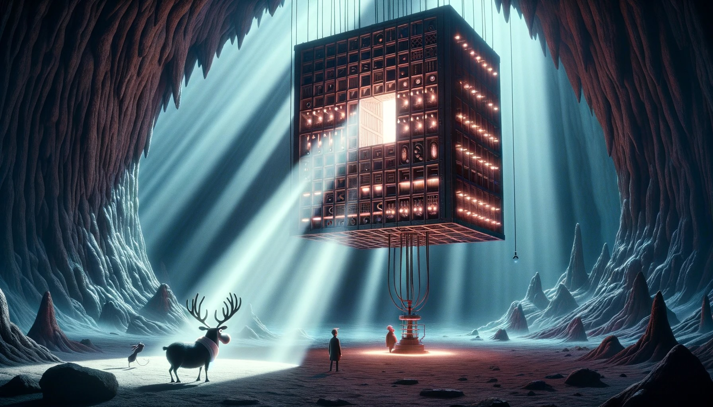

# --- Day 16: The Floor Will Be Lava ---

With the beam of light completely focused somewhere, the reindeer leads you deeper still into the Lava Production
Facility. At some point, you realize that the steel facility walls have been replaced with cave, and the doorways are
just cave, and the floor is cave, and you're pretty sure this is actually just a giant cave.

Finally, as you approach what must be the heart of the mountain, you see a bright light in a cavern up ahead. There, you
discover that the beam of light you so carefully focused is emerging from the cavern wall closest to the facility and
pouring all of its energy into a contraption on the opposite side.

Upon closer inspection, the contraption appears to be a flat, two-dimensional square grid containing empty space (.),
mirrors (/ and \), and splitters (| and -).

The contraption is aligned so that most of the beam bounces around the grid, but each tile on the grid converts some of
the beam's light into heat to melt the rock in the cavern.

