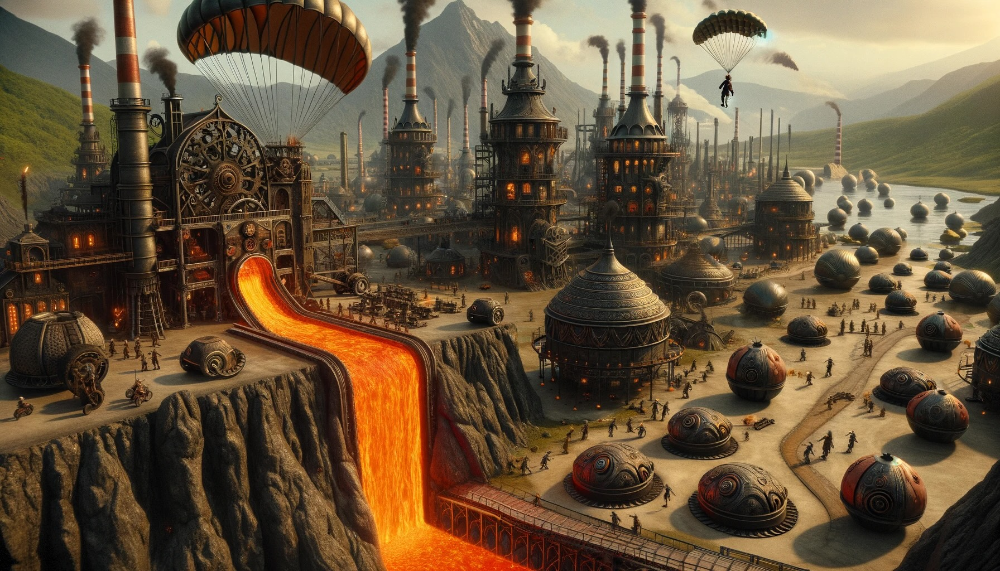

# --- Day 17: Clumsy Crucible ---

The lava starts flowing rapidly once the Lava Production Facility is operational. As you leave, the reindeer offers you
a parachute, allowing you to quickly reach Gear Island.

As you descend, your bird's-eye view of Gear Island reveals why you had trouble finding anyone on your way up: half of
Gear Island is empty, but the half below you is a giant factory city!

You land near the gradually-filling pool of lava at the base of your new lavafall. Lavaducts will eventually carry the
lava throughout the city, but to make use of it immediately, Elves are loading it into large crucibles on wheels.

The crucibles are top-heavy and pushed by hand. Unfortunately, the crucibles become very difficult to steer at high
speeds, and so it can be hard to go in a straight line for very long.

To get Desert Island the machine parts it needs as soon as possible, you'll need to find the best way to get the
crucible from the lava pool to the machine parts factory. To do this, you need to minimize heat loss while choosing a
route that doesn't require the crucible to go in a straight line for too long.

Fortunately, the Elves here have a map (your puzzle input) that uses traffic patterns, ambient temperature, and hundreds
of other parameters to calculate exactly how much heat loss can be expected for a crucible entering any particular city
block.

