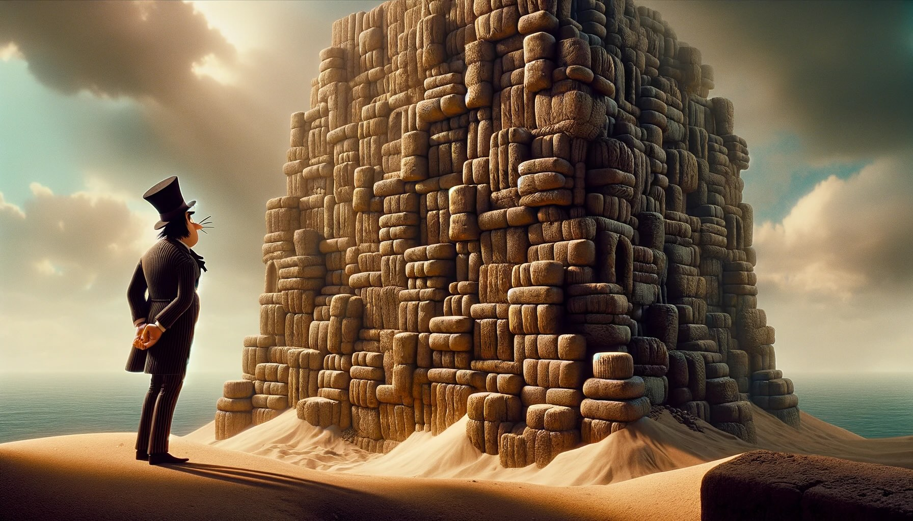

# --- Day 22: Sand Slabs ---
Enough sand has fallen; it can finally filter water for Snow Island.

Well, almost.

The sand has been falling as large compacted bricks of sand, piling up to form an impressive stack here near the edge of Island Island. In order to make use of the sand to filter water, some of the bricks will need to be broken apart - nay, disintegrated - back into freely flowing sand.

The stack is tall enough that you'll have to be careful about choosing which bricks to disintegrate; if you disintegrate the wrong brick, large portions of the stack could topple, which sounds pretty dangerous.

