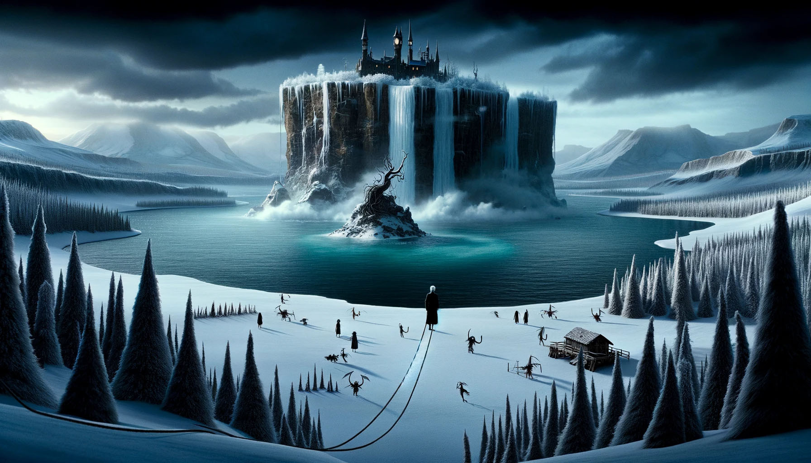

# --- Day 23: A Long Walk ---

The Elves resume water filtering operations! Clean water starts flowing over the edge of Island Island.

They offer to help you go over the edge of Island Island, too! Just hold on tight to one end of this impossibly long
rope and they'll lower you down a safe distance from the massive waterfall you just created.

As you finally reach Snow Island, you see that the water isn't really reaching the ground: it's being absorbed by the
air itself. It looks like you'll finally have a little downtime while the moisture builds up to snow-producing levels.
Snow Island is pretty scenic, even without any snow; why not take a walk?

