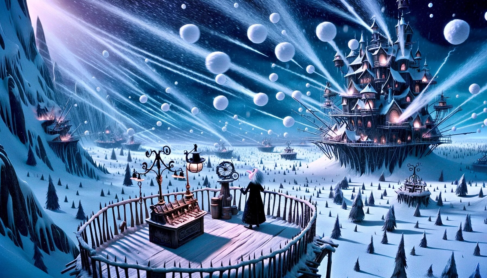

# Day 24: Never Tell Me The Odds

It seems like something is going wrong with the snow-making process. Instead of forming snow, the water that's been
absorbed into the air seems to be forming hail!

Maybe there's something you can do to break up the hailstones?

Due to strong, probably-magical winds, the hailstones are all flying through the air in perfectly linear trajectories.

