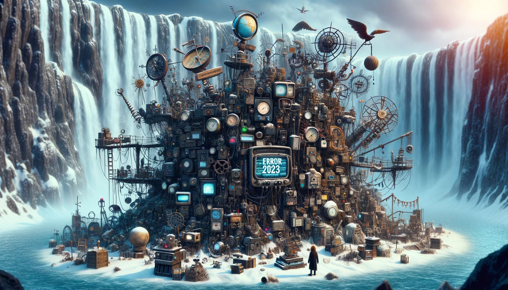

# --- Day 25: Snowverload ---
Still somehow without snow, you go to the last place you haven't checked: the center of Snow Island, directly below the waterfall.

Here, someone has clearly been trying to fix the problem. Scattered everywhere are hundreds of weather machines, almanacs, communication modules, hoof prints, machine parts, mirrors, lenses, and so on.

Somehow, everything has been wired together into a massive snow-producing apparatus, but nothing seems to be running. You check a tiny screen on one of the communication modules: Error 2023. It doesn't say what Error 2023 means, but it does have the phone number for a support line printed on it.

"Hi, you've reached Weather Machines And So On, Inc. How can I help you?" You explain the situation.

"Error 2023, you say? Why, that's a power overload error, of course! It means you have too many components plugged in. Try unplugging some components and--" You explain that there are hundreds of components here and you're in a bit of a hurry.

"Well, let's see how bad it is; do you see a big red reset button somewhere? It should be on its own module. If you push it, it probably won't fix anything, but it'll report how overloaded things are." After a minute or two, you find the reset button; it's so big that it takes two hands just to get enough leverage to push it. Its screen then displays:

```
SYSTEM OVERLOAD!

Connected components would require
power equal to at least 100 stars!
```

"Wait, how many components did you say are plugged in? With that much equipment, you could produce snow for an entire--" You disconnect the call.

You have nowhere near that many stars - you need to find a way to disconnect at least half of the equipment here, but it's already Christmas! You only have time to disconnect three wires.

