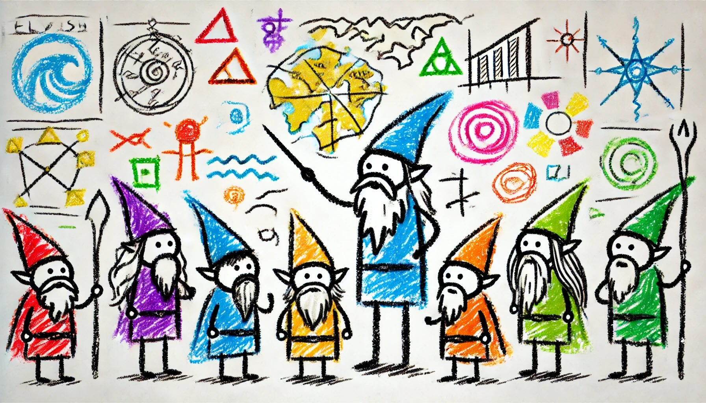

# Day 1: Historian Hysteria

The Chief Historian is always present for the big Christmas sleigh launch, but nobody has seen him in months! Last anyone heard, he was visiting locations that are historically significant to the North Pole; a group of Senior Historians has asked you to accompany them as they check the places they think he was most likely to visit.

You haven't even left yet and the group of Elvish Senior Historians has already hit a problem: their list of locations to check is currently empty. Eventually, someone decides that the best place to check first would be the Chief Historian's office.

Upon pouring into the office, everyone confirms that the Chief Historian is indeed nowhere to be found. Instead, the Elves discover an assortment of notes and lists of historically significant locations! This seems to be the planning the Chief Historian was doing before he left. Perhaps these notes can be used to determine which locations to search?

