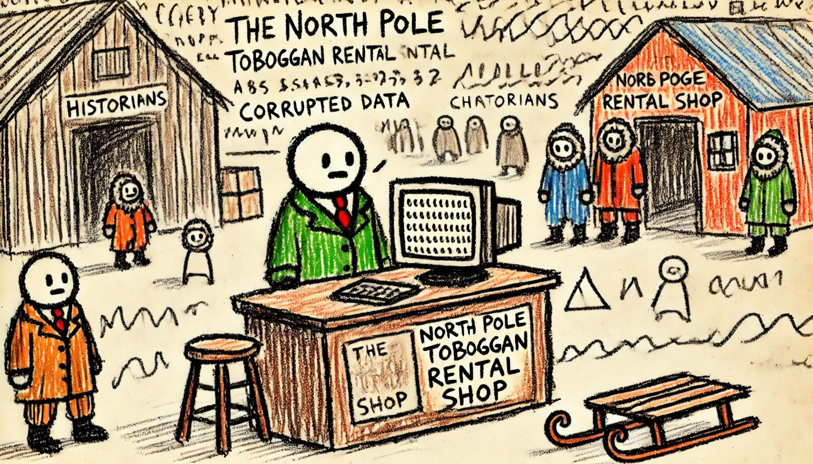

# Day 3: Mull It Over
"Our computers are having issues, so I have no idea if we have any Chief Historians in stock! You're welcome to check the warehouse, though," says the mildly flustered shopkeeper at the North Pole Toboggan Rental Shop. The Historians head out to take a look.

The shopkeeper turns to you. "Any chance you can see why our computers are having issues again?"

The computer appears to be trying to run a program, but its memory (your puzzle input) is corrupted. All of the instructions have been jumbled up!

