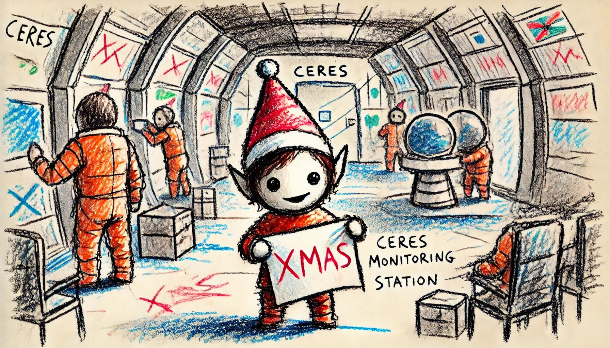

# Day 4: Ceres Search
"Looks like the Chief's not here. Next!" One of The Historians pulls out a device and pushes the only button on it. After a brief flash, you recognize the interior of the Ceres monitoring station!

As the search for the Chief continues, a small Elf who lives on the station tugs on your shirt; she'd like to know if you could help her with her word search (your puzzle input). She only has to find one word: XMAS.

