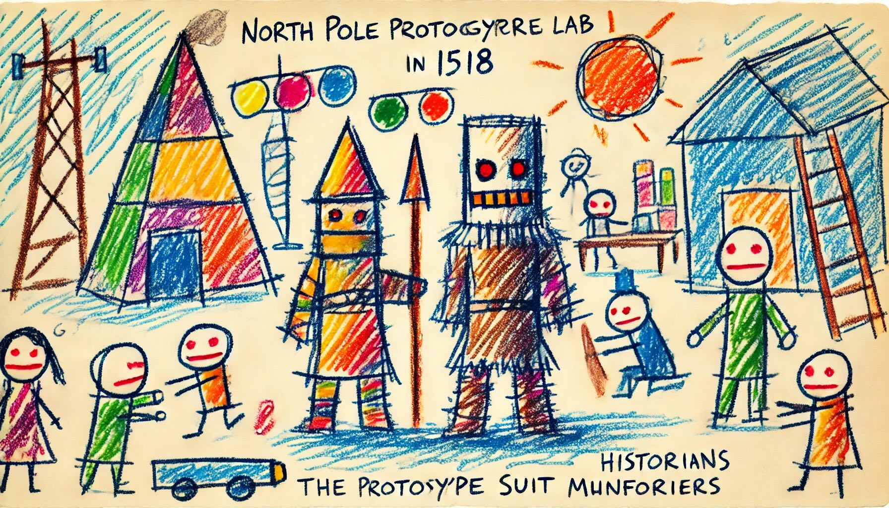

# Day 6: Guard Gallivant
The Historians use their fancy device again, this time to whisk you all away to the North Pole prototype suit manufacturing lab... in the year 1518! It turns out that having direct access to history is very convenient for a group of historians.

You still have to be careful of time paradoxes, and so it will be important to avoid anyone from 1518 while The Historians search for the Chief. Unfortunately, a single guard is patrolling this part of the lab.

