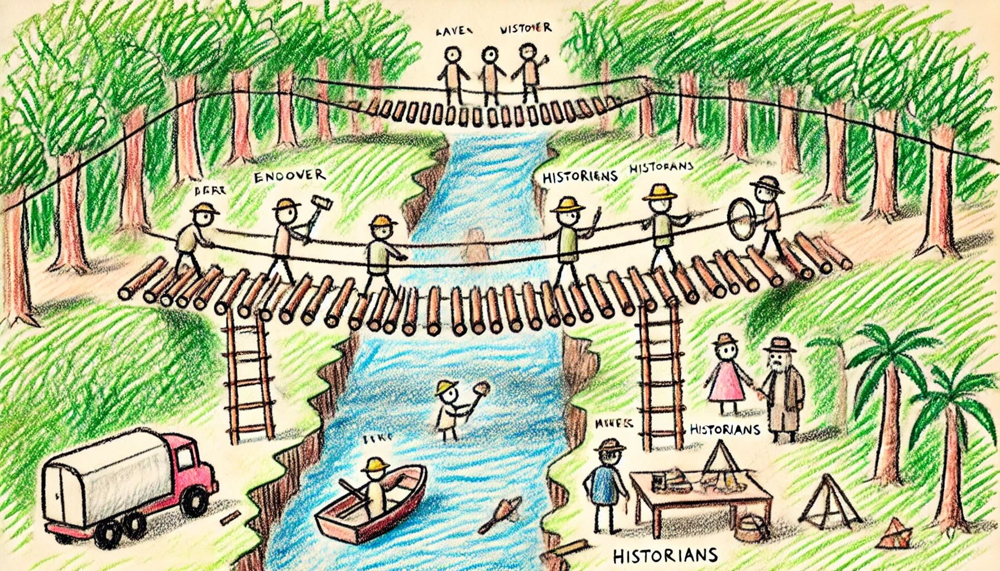

# Day 7: Bridge Repair
The Historians take you to a familiar rope bridge over a river in the middle of a jungle. The Chief isn't on this side of the bridge, though; maybe he's on the other side?

When you go to cross the bridge, you notice a group of engineers trying to repair it. (Apparently, it breaks pretty frequently.) You won't be able to cross until it's fixed.

