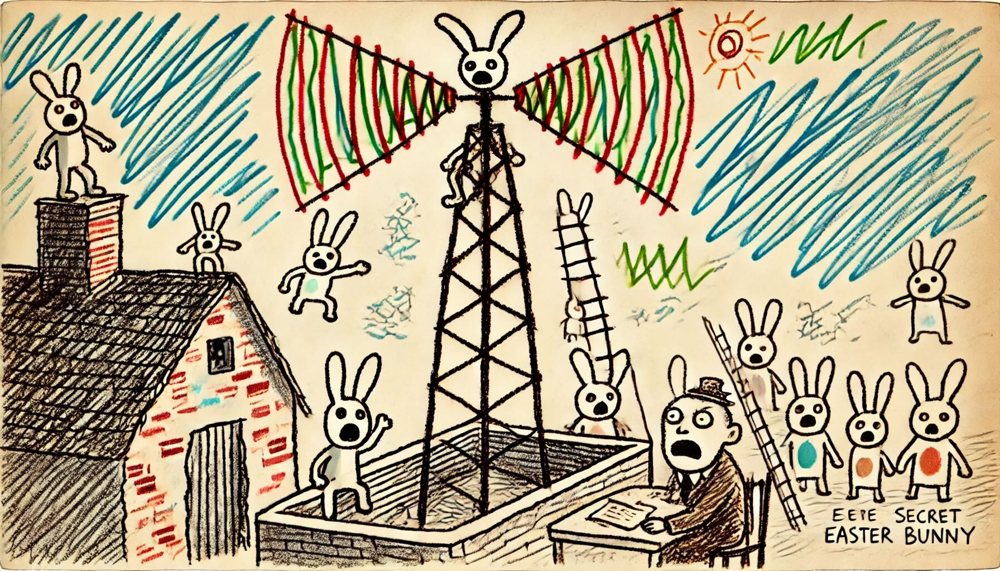

# Day 8: Resonant Collinearity
You find yourselves on the roof of a top-secret Easter Bunny installation.

While The Historians do their thing, you take a look at the familiar huge antenna. Much to your surprise, it seems to have been reconfigured to emit a signal that makes people 0.1% more likely to buy Easter Bunny brand Imitation Mediocre Chocolate as a Christmas gift! Unthinkable!

