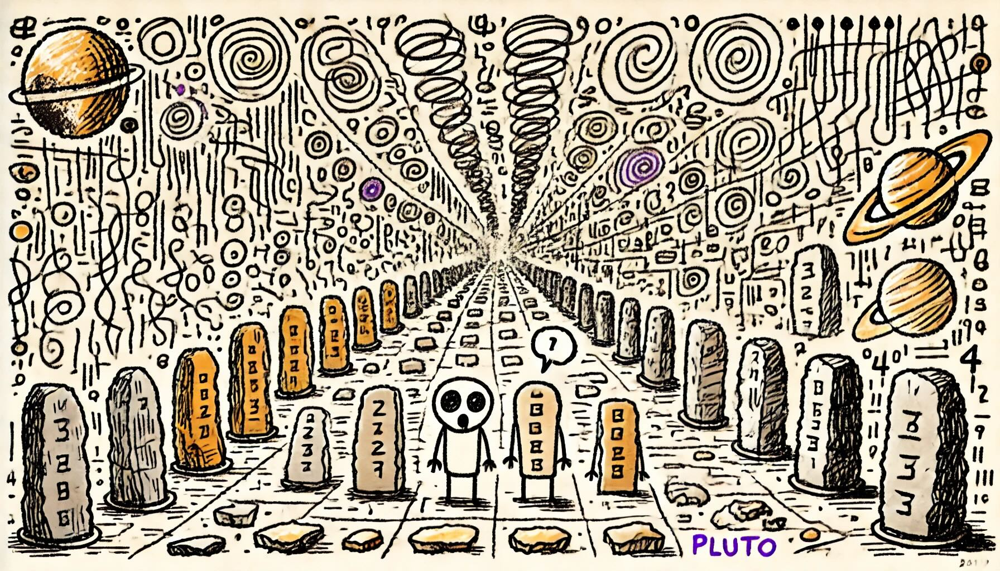

# Day 11: Plutonian Pebbles
The ancient civilization on Pluto was known for its ability to manipulate spacetime, and while The Historians explore their infinite corridors, you've noticed a strange set of physics-defying stones.

At first glance, they seem like normal stones: they're arranged in a perfectly straight line, and each stone has a number engraved on it.

The strange part is that every time you blink, the stones change.

Sometimes, the number engraved on a stone changes. Other times, a stone might split in two, causing all the other stones to shift over a bit to make room in their perfectly straight line.

