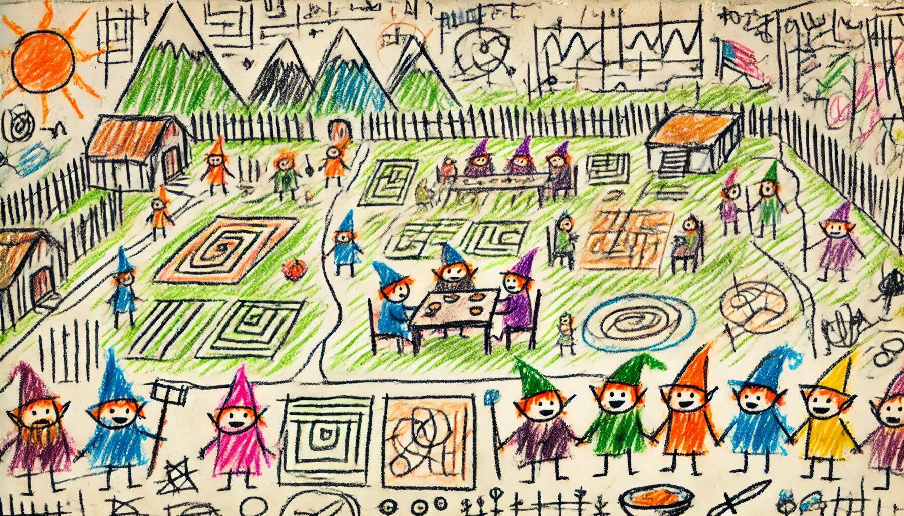

# Day 12: Garden Groups
Why not search for the Chief Historian near the gardener and his massive farm? There's plenty of food, so The Historians grab something to eat while they search.

You're about to settle near a complex arrangement of garden plots when some Elves ask if you can lend a hand. They'd like to set up fences around each region of garden plots, but they can't figure out how much fence they need to order or how much it will cost. They hand you a map (your puzzle input) of the garden plots.

