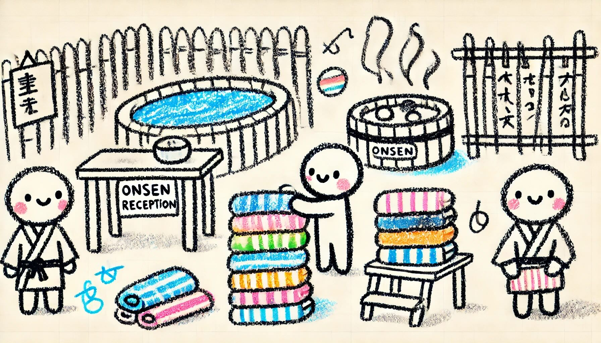

# Day 19: Linen Layout
Today, The Historians take you up to the hot springs on Gear Island! Very suspiciously, absolutely nothing goes wrong as they begin their careful search of the vast field of helixes.

Could this finally be your chance to visit the onsen next door? Only one way to find out.

After a brief conversation with the reception staff at the onsen front desk, you discover that you don't have the right kind of money to pay the admission fee. However, before you can leave, the staff get your attention. Apparently, they've heard about how you helped at the hot springs, and they're willing to make a deal: if you can simply help them arrange their towels, they'll let you in for free!

