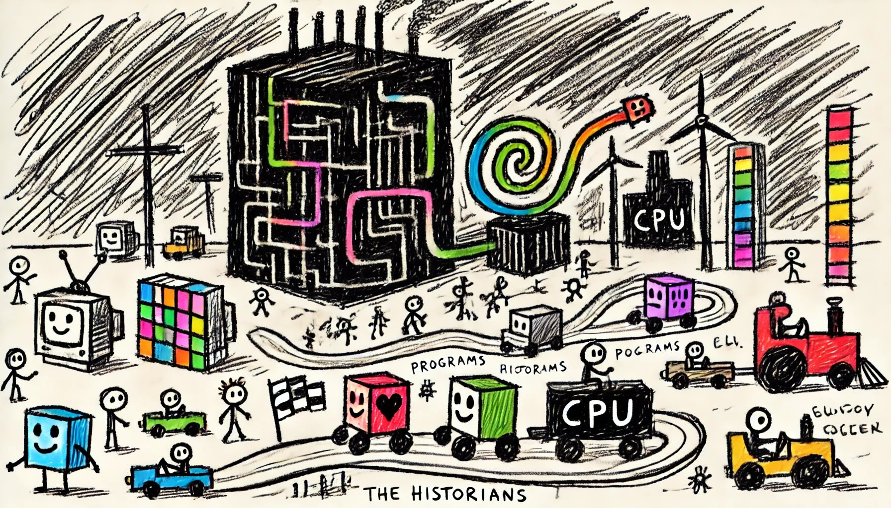

# Day 20: Race Condition
The Historians are quite pixelated again. This time, a massive, black building looms over you - you're right outside the CPU!

While The Historians get to work, a nearby program sees that you're idle and challenges you to a race. Apparently, you've arrived just in time for the frequently-held race condition festival!

The race takes place on a particularly long and twisting code path; programs compete to see who can finish in the fewest picoseconds. The winner even gets their very own mutex!

