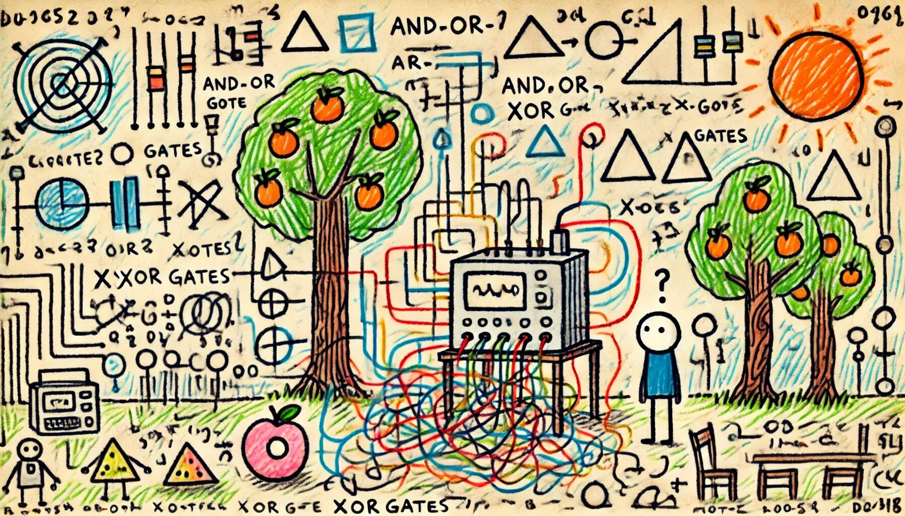

# Day 24: Crossed Wires
You and The Historians arrive at the edge of a large grove somewhere in the jungle. After the last incident, the Elves installed a small device that monitors the fruit. While The Historians search the grove, one of them asks if you can take a look at the monitoring device; apparently, it's been malfunctioning recently.

